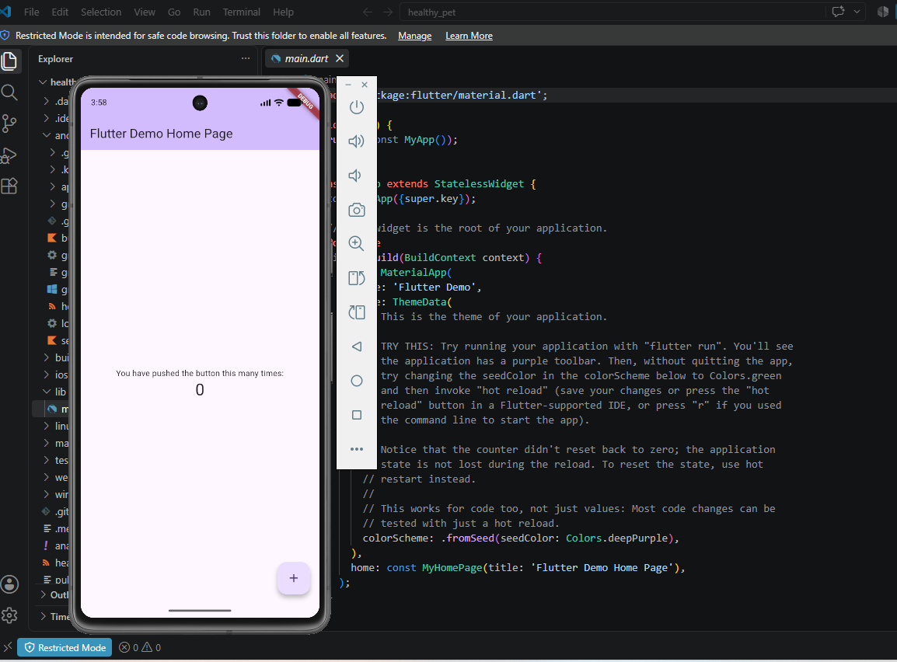

# Healthy Pet 🐾

Aplicación móvil desarrollada con Flutter y Dart como parte de la asignatura **Desarrollo de Aplicaciones Móviles**.

## Autor

**Alberto Steve Espinoza Espinoza**

## Descripción del proyecto

**Healthy Pet** es un emprendimiento orientado a la elaboración y comercialización de snacks y postres saludables para perros y gatos.

La propuesta nace con el objetivo de ofrecer alternativas diferentes a los productos comerciales tradicionales, utilizando ingredientes naturales y de calidad que permitan complementar de manera responsable la alimentación de las mascotas.

El nombre **Healthy Pet** significa “Mascota Saludable” y representa la finalidad principal del proyecto: contribuir al bienestar de perros y gatos mediante productos nutritivos y elaborados pensando en su cuidado.

El eslogan del emprendimiento es:

**“Amor en cada bocado”**

## Objetivo general

Desarrollar un emprendimiento dedicado a la elaboración y comercialización de snacks y postres saludables para perros y gatos, utilizando ingredientes naturales y de calidad que contribuyan a su bienestar y satisfagan las necesidades de sus dueños.

## Objetivos específicos

* Elaborar snacks y postres para perros y gatos utilizando ingredientes naturales, frescos y de calidad.
* Ofrecer productos variados que respondan a las preferencias y necesidades de las mascotas y sus dueños.
* Promover una alimentación más saludable y responsable.
* Ofrecer productos a precios accesibles y competitivos.
* Dar a conocer el emprendimiento mediante diferentes medios de difusión.

## Misión

La misión de Healthy Pet es elaborar y ofrecer snacks y postres saludables para perros y gatos, utilizando ingredientes naturales y de calidad.

El emprendimiento busca brindar alternativas nutritivas y accesibles que contribuyan al bienestar de las mascotas, promoviendo una alimentación más consciente y responsable por parte de sus dueños.

## Visión

La visión de Healthy Pet es convertirse en un emprendimiento reconocido por ofrecer productos saludables y naturales para mascotas, destacándose por la calidad, innovación y dedicación en cada uno de sus productos.

También busca fomentar una mayor conciencia sobre la importancia de una alimentación adecuada para mejorar el bienestar y la calidad de vida de perros y gatos.

## Aplicación móvil

La aplicación móvil de Healthy Pet fue desarrollada utilizando **Flutter y Dart**.

En esta primera versión se presenta la identidad del emprendimiento, su logotipo, información sobre sus productos y una interfaz sencilla orientada a demostrar los conceptos básicos aprendidos durante la materia.

La pantalla principal presenta:

* Logotipo de Healthy Pet.
* Eslogan “Amor en cada bocado”.
* Descripción del emprendimiento.
* Snacks naturales.
* Postres saludables.
* Ingredientes de calidad.
* Botón interactivo para consultar información adicional.
* Colores personalizados relacionados con la identidad del emprendimiento.

## Tecnologías utilizadas

* Flutter.
* Dart.
* Visual Studio Code.
* Android Studio.
* Android Emulator.
* GitHub.

## Widgets utilizados

Para desarrollar la interfaz se utilizaron diferentes widgets de Flutter, entre ellos:

* `MaterialApp`
* `Scaffold`
* `AppBar`
* `SingleChildScrollView`
* `Column`
* `Row`
* `Card`
* `Container`
* `Text`
* `Image`
* `Icon`
* `Padding`
* `SizedBox`
* `Divider`
* `ElevatedButton`

También se utiliza un `StatefulWidget` para manejar cambios en la interfaz después de una acción realizada por el usuario.

## Paquete externo

Para personalizar la tipografía de la aplicación se instaló el paquete:

`google_fonts`

La instalación se realizó mediante:

```bash
flutter pub add google_fonts
```

Dentro del proyecto se utiliza **Google Fonts** para aplicar una tipografía personalizada a diferentes elementos de texto de Healthy Pet.

## Interacción de la aplicación

La aplicación incorpora un botón denominado:

**Conocer Healthy Pet**

Al presionar este botón se muestra información adicional relacionada con el emprendimiento.

Para controlar este comportamiento se utiliza una variable booleana junto con `setState()`.

Ejemplo:

```dart
setState(() {
  mostrarInformacion = !mostrarInformacion;
});
```

Esto permite actualizar la interfaz cada vez que el usuario presiona el botón.

Cuando la información se encuentra visible, el botón permite volver a ocultarla.

## Colores de Healthy Pet

La aplicación utiliza colores relacionados con la identidad visual del emprendimiento:

* **Verde:** representa naturaleza, bienestar y alimentación saludable.
* **Marrón:** representa ingredientes naturales.
* **Naranja:** representa energía y vitalidad.

Estos colores también están presentes en el logotipo original de Healthy Pet.

## Ejecución del proyecto

Para obtener las dependencias del proyecto se utiliza:

```bash
flutter pub get
```

Para comprobar los dispositivos disponibles:

```bash
flutter devices
```

Para ejecutar la aplicación:

```bash
flutter run
```

También puede ejecutarse directamente sobre un emulador Android utilizando su identificador:

```bash
flutter run -d ID_DEL_EMULADOR
```

## Evidencias

### 1. Configuración de Flutter

Se ejecutó `flutter doctor` para verificar la instalación y configuración del entorno de desarrollo.


### 2. Emulador Android

Se verificó el funcionamiento del proyecto Flutter utilizando un dispositivo virtual Android.



### 3. Instalación del paquete externo

Se instaló el paquete `google_fonts` mediante la terminal.


### 4. Google Fonts en pubspec.yaml

El paquete `google_fonts` fue agregado correctamente dentro de las dependencias del proyecto.


### 5. Aplicación Healthy Pet

La aplicación se ejecuta correctamente en el emulador Android y presenta la identidad visual y los productos principales del emprendimiento.


### 6. Aplicación instalada en el emulador

Se realizó una comprobación adicional desde el menú de aplicaciones del dispositivo virtual.


## Estructura principal del proyecto

```text
healthy_pet/
├── android/
├── assets/
│   └── images/
├── capturas/
├── lib/
│   └── main.dart
├── test/
├── pubspec.yaml
├── pubspec.lock
└── README.md
```

## Historial de desarrollo

El proyecto fue desarrollado progresivamente mediante diferentes commits para demostrar las distintas etapas de creación de la aplicación.

Los cambios principales corresponden a:

1. Creación inicial del proyecto Flutter.
2. Incorporación del logotipo y paquete externo.
3. Desarrollo de la interfaz e interacción de Healthy Pet.
4. Incorporación de evidencias y documentación final.

## Estado actual

La primera versión de **Healthy Pet** permite presentar de manera visual el emprendimiento y demostrar conceptos fundamentales del desarrollo de aplicaciones móviles con Flutter.

El proyecto utiliza widgets, imágenes, colores personalizados, un paquete externo y una interacción básica mediante manejo de estado.

Esta aplicación puede continuar evolucionando posteriormente mediante nuevas pantallas y funcionalidades relacionadas con productos, catálogo, pedidos e información para el cuidado y alimentación saludable de mascotas.

## Repositorio

El código fuente completo se encuentra publicado en un repositorio público de GitHub.

**Enlace del repositorio:**
PEGAR AQUÍ EL ENLACE PÚBLICO DEL REPOSITORIO

---

**Healthy Pet — Amor en cada bocado 🐾**

**Autor: Alberto Steve Espinoza Espinoza**

