# Healthy Pet 🐾

Aplicación móvil desarrollada con Flutter y Dart como parte de la asignatura **Desarrollo de Aplicaciones Móviles**.

## Autor

**Alberto Steve Espinoza Espinoza**

## Descripción del proyecto

**Healthy Pet** es un emprendimiento orientado a la elaboración y comercialización de snacks y postres saludables para perros y gatos.

La propuesta nace con el objetivo de ofrecer alternativas diferentes a los productos comerciales tradicionales, utilizando ingredientes naturales y de calidad que permitan complementar de manera responsable la alimentación de las mascotas.

El nombre **Healthy Pet** significa “Mascota Saludable” y representa la finalidad principal del proyecto: contribuir al bienestar de perros y gatos mediante productos nutritivos y elaborados pensando en su cuidado.

El eslogan del emprendimiento es:

**“Amor en cada bocado”**

## Objetivo general

Desarrollar un emprendimiento dedicado a la elaboración y comercialización de snacks y postres saludables para perros y gatos, utilizando ingredientes naturales y de calidad que contribuyan a su bienestar y satisfagan las necesidades de sus dueños.

## Objetivos específicos

* Elaborar snacks y postres para perros y gatos utilizando ingredientes naturales, frescos y de calidad.
* Ofrecer productos variados que respondan a las preferencias y necesidades de las mascotas y sus dueños.
* Promover una alimentación más saludable y responsable.
* Ofrecer productos a precios accesibles y competitivos.
* Dar a conocer el emprendimiento mediante diferentes medios de difusión.

## Misión

La misión de Healthy Pet es elaborar y ofrecer snacks y postres saludables para perros y gatos, utilizando ingredientes naturales y de calidad.

El emprendimiento busca brindar alternativas nutritivas y accesibles que contribuyan al bienestar de las mascotas, promoviendo una alimentación más consciente y responsable por parte de sus dueños.

## Visión

La visión de Healthy Pet es convertirse en un emprendimiento reconocido por ofrecer productos saludables y naturales para mascotas, destacándose por la calidad, innovación y dedicación en cada uno de sus productos.

También busca fomentar una mayor conciencia sobre la importancia de una alimentación adecuada para mejorar el bienestar y la calidad de vida de perros y gatos.

## Aplicación móvil

La aplicación móvil de Healthy Pet fue desarrollada utilizando **Flutter y Dart**.

En esta primera versión se presenta la identidad del emprendimiento, su logotipo, información sobre sus productos y una interfaz sencilla orientada a demostrar los conceptos básicos aprendidos durante la materia.

La pantalla principal presenta:

* Logotipo de Healthy Pet.
* Eslogan “Amor en cada bocado”.
* Descripción del emprendimiento.
* Snacks naturales.
* Postres saludables.
* Ingredientes de calidad.
* Botón interactivo para consultar información adicional.
* Colores personalizados relacionados con la identidad del emprendimiento.

## Tecnologías utilizadas

* Flutter.
* Dart.
* Visual Studio Code.
* Android Studio.
* Android Emulator.
* GitHub.

## Widgets utilizados

Para desarrollar la interfaz se utilizaron diferentes widgets de Flutter, entre ellos:

* `MaterialApp`
* `Scaffold`
* `AppBar`
* `SingleChildScrollView`
* `Column`
* `Row`
* `Card`
* `Container`
* `Text`
* `Image`
* `Icon`
* `Padding`
* `SizedBox`
* `Divider`
* `ElevatedButton`

También se utiliza un `StatefulWidget` para manejar cambios en la interfaz después de una acción realizada por el usuario.

## Paquete externo

Para personalizar la tipografía de la aplicación se instaló el paquete:

`google_fonts`

La instalación se realizó mediante:

```bash
flutter pub add google_fonts
```

Dentro del proyecto se utiliza **Google Fonts** para aplicar una tipografía personalizada a diferentes elementos de texto de Healthy Pet.

## Interacción de la aplicación

La aplicación incorpora un botón denominado:

**Conocer Healthy Pet**

Al presionar este botón se muestra información adicional relacionada con el emprendimiento.

Para controlar este comportamiento se utiliza una variable booleana junto con `setState()`.

Ejemplo:

```dart
setState(() {
  mostrarInformacion = !mostrarInformacion;
});
```

Esto permite actualizar la interfaz cada vez que el usuario presiona el botón.

Cuando la información se encuentra visible, el botón permite volver a ocultarla.

## Colores de Healthy Pet

La aplicación utiliza colores relacionados con la identidad visual del emprendimiento:

* **Verde:** representa naturaleza, bienestar y alimentación saludable.
* **Marrón:** representa ingredientes naturales.
* **Naranja:** representa energía y vitalidad.

Estos colores también están presentes en el logotipo original de Healthy Pet.

## Ejecución del proyecto

Para obtener las dependencias del proyecto se utiliza:

```bash
flutter pub get
```

Para comprobar los dispositivos disponibles:

```bash
flutter devices
```

Para ejecutar la aplicación:

```bash
flutter run
```

También puede ejecutarse directamente sobre un emulador Android utilizando su identificador:

```bash
flutter run -d ID_DEL_EMULADOR
```

## Evidencias

### 1. Configuración de Flutter

Se ejecutó `flutter doctor` para verificar la instalación y configuración del entorno de desarrollo.

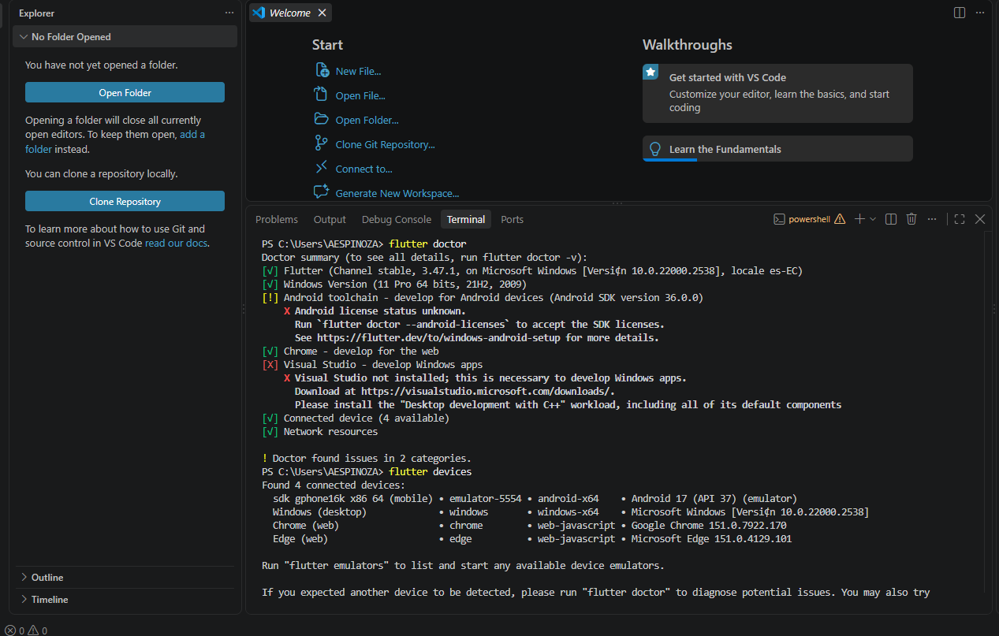

### 2. Emulador Android

Se verificó el funcionamiento del proyecto Flutter utilizando un dispositivo virtual Android.


### 3. Instalación del paquete externo

Se instaló el paquete `google_fonts` mediante la terminal.


### 4. Google Fonts en pubspec.yaml

El paquete `google_fonts` fue agregado correctamente dentro de las dependencias del proyecto.

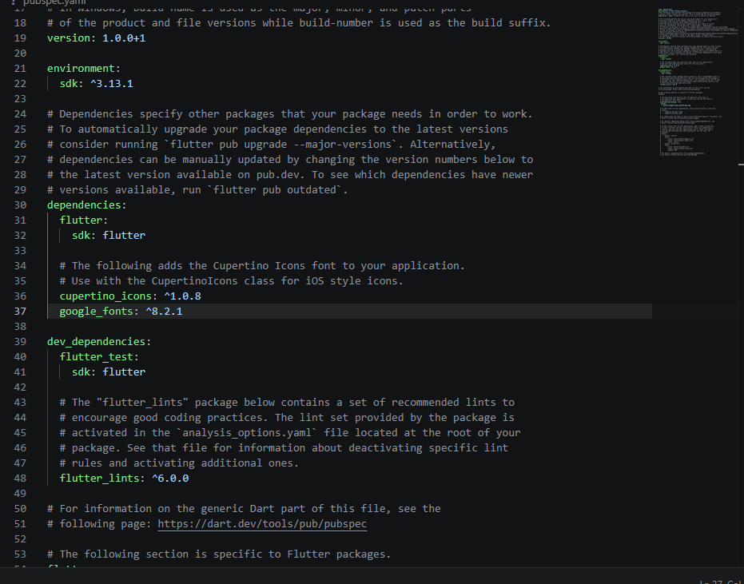

### 5. Aplicación Healthy Pet

La aplicación se ejecuta correctamente en el emulador Android y presenta la identidad visual y los productos principales del emprendimiento.


### 6. Aplicación instalada en el emulador

Se realizó una comprobación adicional desde el menú de aplicaciones del dispositivo virtual.


## Estructura principal del proyecto

```text
healthy_pet/
├── android/
├── assets/
│   └── images/
├── capturas/
├── lib/
│   └── main.dart
├── test/
├── pubspec.yaml
├── pubspec.lock
└── README.md
```

## Historial de desarrollo

El proyecto fue desarrollado progresivamente mediante diferentes commits para demostrar las distintas etapas de creación de la aplicación.

Los cambios principales corresponden a:

1. Creación inicial del proyecto Flutter.
2. Incorporación del logotipo y paquete externo.
3. Desarrollo de la interfaz e interacción de Healthy Pet.
4. Incorporación de evidencias y documentación final.

## Estado actual

La primera versión de **Healthy Pet** permite presentar de manera visual el emprendimiento y demostrar conceptos fundamentales del desarrollo de aplicaciones móviles con Flutter.

El proyecto utiliza widgets, imágenes, colores personalizados, un paquete externo y una interacción básica mediante manejo de estado.

Esta aplicación puede continuar evolucionando posteriormente mediante nuevas pantallas y funcionalidades relacionadas con productos, catálogo, pedidos e información para el cuidado y alimentación saludable de mascotas.

## Repositorio

El código fuente completo se encuentra publicado en un repositorio público de GitHub.

**Enlace del repositorio:**
PEGAR AQUÍ EL ENLACE PÚBLICO DEL REPOSITORIO

---

**Healthy Pet — Amor en cada bocado 🐾**

**Autor: Alberto Steve Espinoza Espinoza**


# Actividad Integradora 2
## Desarrollo de una Aplicación Flutter con Navegación y Nuevos Widgets

> **Continuidad del proyecto Healthy Pet**
>
> Esta sección corresponde a la segunda fase del desarrollo de la aplicación Healthy Pet, iniciada en la Actividad Integradora 1.

---

## 1. Continuidad del proyecto

La Actividad Integradora 2 corresponde a la segunda fase del desarrollo de la aplicación móvil **Healthy Pet**.

Esta etapa continúa directamente el proyecto desarrollado durante la Actividad Integradora 1. No se desarrolló una aplicación nueva, sino que se tomó la versión anterior como base para incorporar nuevas funcionalidades, nuevas pantallas, navegación, manejo de estado y una organización más modular del código.

La propuesta y la identidad visual de Healthy Pet se mantienen, incorporando nuevas características para convertir la aplicación inicial en una aplicación móvil más completa e interactiva.

El eslogan del emprendimiento continúa siendo:

**“Amor en cada bocado”**

---

## 2. Objetivo de la Actividad Integradora 2

El objetivo de esta segunda fase fue ampliar la aplicación Healthy Pet mediante la incorporación de:

- Nuevas pantallas.
- Navegación entre pantallas.
- Nuevos widgets de Flutter.
- Organización del código en diferentes carpetas y archivos.
- Manejo básico del estado mediante `setState()`.
- Interacciones con el usuario.
- Uso de `SnackBar`.
- Uso de `AlertDialog`.
- Navegación mediante `NavigationBar`.
- Catálogo de productos.
- Detalle de productos.
- Sistema de favoritos.
- Cambio de cantidades y cálculo de subtotales.
- Personalización del nombre, logotipo, colores e ícono de la aplicación.
- Documentación y evidencias del desarrollo.

---

## 3. Mejoras incorporadas en esta fase

Durante la Actividad Integradora 2 se realizaron las siguientes mejoras sobre la aplicación desarrollada en la primera fase.

### Catálogo de productos

Se incorporó un catálogo visual de productos utilizando una cuadrícula mediante `GridView`.

Los productos disponibles son:

- Snack Natural.
- Galletas de Avena.
- Premios de Pollo.
- Mix Saludable.

Cada producto presenta:

- Imagen.
- Nombre.
- Descripción.
- Precio.
- Botón de favoritos.

### Detalle de producto

Se incorporó una nueva pantalla para consultar la información detallada de cada producto.

El usuario puede consultar:

- Imagen.
- Nombre.
- Precio.
- Descripción.
- Cantidad.
- Subtotal.
- Estado de favorito.
- Información adicional.

### Sistema de favoritos

Se implementó un sistema que permite agregar y eliminar productos de favoritos.

Los productos seleccionados pueden visualizarse posteriormente desde la pantalla **Mis favoritos**.

### Control de cantidad

En la pantalla de detalle se incorporaron botones para aumentar o disminuir la cantidad de productos.

El subtotal se actualiza automáticamente de acuerdo con la cantidad seleccionada.

### Información adicional

Se incorporaron diálogos mediante `AlertDialog` para mostrar información adicional sobre los productos y datos de contacto de Healthy Pet.

---

## 4. Pantallas desarrolladas

En esta segunda fase se implementaron cuatro pantallas principales relacionadas con la temática de Healthy Pet.

### Inicio

Es la pantalla principal de la aplicación.

Presenta:

- Logotipo.
- Nombre Healthy Pet.
- Eslogan.
- Información introductoria.
- Acceso a las diferentes secciones de la aplicación.

### Productos

Presenta el catálogo de productos de Healthy Pet.

La pantalla utiliza un `GridView` para organizar visualmente los productos en dos columnas.

Desde esta pantalla el usuario puede:

- Consultar productos.
- Abrir el detalle de un producto.
- Agregar productos a favoritos.
- Acceder a la pantalla de favoritos.

### Favoritos

Presenta los productos que fueron seleccionados por el usuario.

Desde esta pantalla se puede:

- Consultar los productos favoritos.
- Visualizar su precio.
- Eliminar productos de favoritos.

### Nosotros

Presenta información sobre el emprendimiento Healthy Pet.

Incluye:

- Misión.
- Visión.
- Valores.
- Información de contacto.
- Identidad visual del emprendimiento.

---

## 5. Pantalla de detalle de producto

Además de las cuatro pantallas principales, se incorporó una pantalla adicional para consultar el detalle de cada producto.

La navegación funciona de la siguiente manera:

```text
Inicio
   |
   +-- Productos
          |
          +-- Snack Natural
          +-- Galletas de Avena
          +-- Premios de Pollo
          +-- Mix Saludable
                    |
                    v
             Detalle del producto
```

La pantalla permite modificar la cantidad y visualizar el subtotal correspondiente.

---

## 6. Navegación

Se incorporó navegación utilizando `Navigator`.

Se utilizaron acciones como:

```dart
Navigator.push()
```

para navegar hacia nuevas pantallas y:

```dart
Navigator.pop()
```

para regresar a la pantalla anterior.

También se implementó una navegación principal mediante `NavigationBar`.

La aplicación permite acceder directamente a:

- Inicio.
- Productos.
- Favoritos.
- Nosotros.

Esta navegación facilita el acceso a las principales funcionalidades de la aplicación.

---

## 7. Widgets incorporados

Durante esta segunda fase se incorporaron y utilizaron diferentes widgets de Flutter.

Entre los principales se encuentran:

- `MaterialApp`
- `Scaffold`
- `AppBar`
- `NavigationBar`
- `NavigationDestination`
- `GridView`
- `ListView`
- `ListView.separated`
- `ListTile`
- `Card`
- `CircleAvatar`
- `Divider`
- `Image`
- `Icon`
- `IconButton`
- `ElevatedButton`
- `OutlinedButton`
- `Padding`
- `SizedBox`
- `Expanded`
- `Container`
- `Column`
- `Row`
- `Stack`
- `InkWell`
- `SnackBar`
- `AlertDialog`
- `StatefulWidget`

Con esto se supera ampliamente el requisito mínimo de cinco widgets solicitado en la actividad.

---

## 8. Interacciones implementadas

La aplicación incorpora diferentes interacciones.

### Navegación entre pantallas

El usuario puede desplazarse entre Inicio, Productos, Favoritos y Nosotros mediante la navegación principal.

### Selección de productos

Al tocar una tarjeta del catálogo se abre la pantalla de detalle correspondiente.

### Favoritos

El usuario puede agregar y eliminar productos de favoritos mediante el botón representado por el ícono de corazón.

### Cambio de cantidad

En el detalle del producto se puede aumentar o disminuir la cantidad mediante los botones `+` y `-`.

### Actualización del subtotal

El subtotal se recalcula automáticamente según la cantidad seleccionada.

### SnackBar

Se utiliza `SnackBar` para informar al usuario cuando un producto:

- Es agregado a favoritos.
- Es eliminado de favoritos.

### AlertDialog

Se utiliza `AlertDialog` para mostrar información adicional y datos de contacto.

---

## 9. Manejo del estado mediante setState()

Uno de los requisitos principales de la Actividad Integradora 2 fue implementar una funcionalidad que modificara información en pantalla utilizando `setState()`.

Healthy Pet utiliza `setState()` principalmente para controlar el estado de los productos favoritos.

Ejemplo:

```dart
setState(() {
  productos[indice].favorito =
      !productos[indice].favorito;
});
```

Cuando el usuario presiona el botón de favoritos, el estado cambia entre:

- Producto no seleccionado.
- Producto seleccionado.

La interfaz se reconstruye automáticamente mostrando el nuevo estado.

También se utiliza `setState()` para controlar la cantidad:

```dart
setState(() {
  cantidad++;
});
```

De esta forma el usuario puede modificar la cantidad y observar inmediatamente el nuevo subtotal.

---

## 10. Organización del proyecto

A diferencia de la primera versión, en esta fase se reorganizó el código para evitar concentrar toda la aplicación en `main.dart`.

La estructura actual es:

```text
healthy_pet/
|
+-- android/
|
+-- assets/
|   +-- images/
|       +-- logo_healthy_pet.png
|       +-- snack_natural.png
|       +-- galletas.png
|       +-- premios.png
|       +-- mix_saludable.png
|
+-- capturas/
|
+-- capturas2/
|
+-- lib/
|   +-- data/
|   |   +-- productos_data.dart
|   |
|   +-- models/
|   |   +-- producto.dart
|   |
|   +-- screens/
|   |   +-- inicio_screen.dart
|   |   +-- productos_screen.dart
|   |   +-- favoritos_screen.dart
|   |   +-- nosotros_screen.dart
|   |   +-- detalle_producto_screen.dart
|   |   +-- principal_screen.dart
|   |
|   +-- theme/
|   |   +-- tema_app.dart
|   |
|   +-- widgets/
|   |   +-- producto_card.dart
|   |
|   +-- main.dart
|
+-- test/
|   +-- widget_test.dart
|
+-- pubspec.yaml
+-- pubspec.lock
+-- README.md
```

La organización permite separar las responsabilidades del proyecto en:

- `models`: modelos de datos.
- `data`: información inicial de los productos.
- `screens`: pantallas de la aplicación.
- `widgets`: componentes reutilizables.
- `theme`: configuración visual.
- `assets`: imágenes y recursos.
- `capturas2`: evidencias de la Actividad Integradora 2.

---

## 11. Modelo de producto

Los productos se manejan mediante el modelo:

`Producto`

Este modelo contiene información como:

- Nombre.
- Descripción.
- Precio.
- Imagen.
- Estado de favorito.

Los datos iniciales se encuentran separados en:

`lib/data/productos_data.dart`

Esto permite mantener separada la información de los productos de las pantallas.

---

## 12. Widget reutilizable ProductoCard

Para evitar repetir código en el catálogo se creó el widget:

`lib/widgets/producto_card.dart`

Este componente se encarga de representar visualmente cada producto.

El widget utiliza:

- `Card`.
- `InkWell`.
- `Image`.
- `IconButton`.
- `Expanded`.
- `Stack`.
- `Text`.
- `Padding`.

Además permite navegar hacia el detalle del producto al tocar la tarjeta.

---

## 13. Paquete externo

Se utilizó el paquete externo:

`google_fonts`

El paquete permite utilizar tipografías personalizadas dentro de la aplicación.

La dependencia forma parte del archivo:

`pubspec.yaml`

y se incorporó mediante:

```bash
flutter pub add google_fonts
```

Su utilización permite mantener una presentación visual personalizada y coherente con la identidad de Healthy Pet.

---

## 14. Personalización de la aplicación

La aplicación mantiene la identidad visual desarrollada durante la Actividad Integradora 1 y la amplía en esta segunda fase.

### Nombre

La aplicación se identifica como:

**Healthy Pet**

### Eslogan

**Amor en cada bocado**

### Logotipo

Se utiliza el logotipo de Healthy Pet como imagen representativa.

Ubicación:

`assets/images/logo_healthy_pet.png`

### Imágenes de productos

Se incorporaron imágenes específicas para:

- Snack Natural.
- Galletas de Avena.
- Premios de Pollo.
- Mix Saludable.

### Colores

Se mantienen tonalidades relacionadas con:

- Naturaleza.
- Bienestar.
- Alimentación saludable.
- Productos naturales.

Los estilos principales se centralizan en:

`lib/theme/tema_app.dart`

### Launcher Icon

Se personalizó el ícono de la aplicación Android utilizando el logotipo de Healthy Pet.

El ícono personalizado fue comprobado directamente en el menú de aplicaciones del emulador Android.

---

## 15. Evidencias de la Actividad Integradora 2

Las evidencias de esta segunda fase se encuentran organizadas en:

`capturas2/`

### Pantalla principal

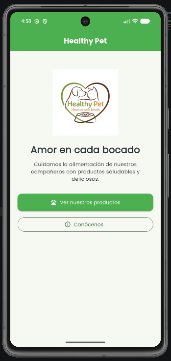

### Catálogo de productos


### Detalle del producto


### Producto favorito

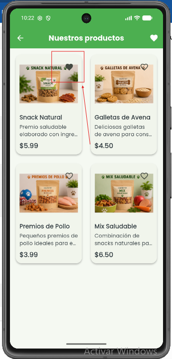

### Mis favoritos

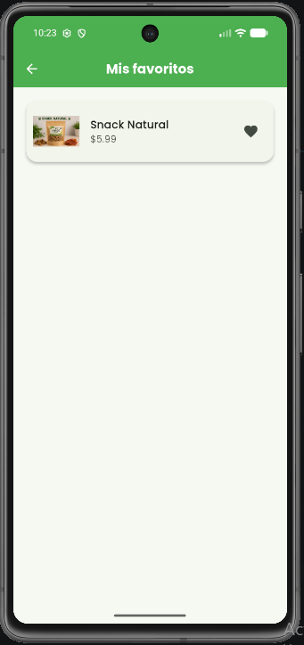

### Cambio de cantidad


### AlertDialog

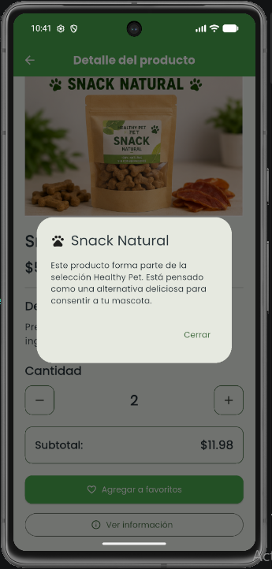

### Pantalla Nosotros


### Navegación principal


### Productos mediante NavigationBar


### Launcher Icon

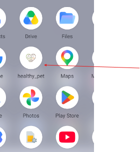

---

## 16. Historial de desarrollo de la Actividad Integradora 2

El desarrollo de esta segunda fase se realizó progresivamente mediante commits independientes.

### Commit 1
Preparar base de Healthy Pet para Actividad Integradora 2.

### Commit 2
Crear nueva interfaz principal de Healthy Pet.

### Commit 3
Crear catálogo visual de productos.

### Commit 4
Implementar navegación entre pantallas.

### Commit 5
Crear detalle e interacción de productos.

### Commit 6
Implementar favoritos con `setState()`.

### Commit 7
Agregar cantidad y `AlertDialog` al detalle.

### Commit 8
Mejorar pantalla Nosotros e información de contacto.

### Commit 9
Implementar navegación principal de la aplicación.

### Commit 10
Actualizar documentación y finalizar Actividad Integradora 2.

---

## 17. Ejecución del proyecto

Para obtener las dependencias:

```bash
flutter pub get
```

Para verificar los dispositivos disponibles:

```bash
flutter devices
```

Para analizar el proyecto:

```bash
flutter analyze
```

Para ejecutar la aplicación:

```bash
flutter run
```

También puede ejecutarse directamente sobre el emulador Android:

```bash
flutter run -d emulator-5554
```

La aplicación fue comprobada utilizando un emulador Android.

---

## 18. Resultado de la Actividad Integradora 2

Al finalizar esta segunda fase, Healthy Pet cuenta con una aplicación móvil más completa que la versión desarrollada durante la Actividad Integradora 1.

Las principales mejoras son:

- Cuatro pantallas principales.
- Pantalla adicional de detalle de producto.
- Navegación mediante `Navigator`.
- Navegación mediante `NavigationBar`.
- Catálogo de productos.
- Sistema de favoritos.
- Manejo de estado mediante `setState()`.
- Control de cantidades.
- Cálculo de subtotales.
- `SnackBar`.
- `AlertDialog`.
- Widgets reutilizables.
- Organización modular del código.
- Imágenes de productos.
- Logotipo.
- Launcher Icon personalizado.
- Paquete externo `google_fonts`.
- Evidencias documentadas.

---

## 19. Continuidad del proyecto

La Actividad Integradora 2 representa la segunda fase del desarrollo de Healthy Pet.

El proyecto mantiene la base conceptual, identidad visual y funcionalidad desarrollada durante la Actividad Integradora 1 y amplía progresivamente sus características.

La aplicación continuará evolucionando en futuras actividades académicas, manteniendo la estructura desarrollada en esta fase y agregando nuevas funcionalidades sobre la versión actual.

La siguiente etapa del proyecto corresponderá a la **Actividad Integradora 3**, en la cual se continuará trabajando sobre esta misma aplicación.

---

## Healthy Pet 🐾

**Amor en cada bocado**

**Actividad Integradora 2 — Desarrollo de Aplicaciones Móviles**

Autor: **Alberto Steve Espinoza Espinoza**

---

# Actividad Integradora 3
## Gestión de estado, Provider, widgets reutilizables y carrito de compras

> **Continuidad del proyecto Healthy Pet**
>
> Esta sección corresponde a la tercera fase del desarrollo de la aplicación móvil **Healthy Pet**. La Actividad Integradora 3 continúa directamente sobre la aplicación desarrollada en las Actividades Integradoras 1 y 2, manteniendo su identidad visual, productos, navegación y estructura modular.

---

## 1. Continuidad del proyecto

La **Actividad Integradora 3** representa una nueva etapa de evolución de Healthy Pet.

En esta fase no se creó una aplicación independiente. Se tomó como base la versión desarrollada durante la Actividad Integradora 2 y se incorporaron nuevas funcionalidades relacionadas con:

- Gestión de estado compartido.
- Uso del paquete `provider`.
- Implementación de `ChangeNotifier`.
- Uso de `notifyListeners()`.
- Uso de `ChangeNotifierProvider`.
- Uso de `Consumer`.
- Modelo adicional para los elementos del carrito.
- Carrito de compras.
- Actualización dinámica de cantidades y totales.
- Nuevos widgets reutilizables.
- Integración entre diferentes pantallas.
- Mejoras de navegación y experiencia de usuario.
- Evidencias del desarrollo mediante capturas de pantalla.

La identidad visual y el concepto de Healthy Pet se mantienen.

El eslogan continúa siendo:

**“Amor en cada bocado”**

---

## 2. Objetivo de la Actividad Integradora 3

El objetivo de esta tercera fase fue continuar el desarrollo de Healthy Pet incorporando un mecanismo de gestión de estado compartido mediante **Provider**, permitiendo que los cambios realizados en una pantalla se reflejen automáticamente en otras pantallas de la aplicación.

Además, se buscó fortalecer la organización del proyecto mediante modelos, providers, pantallas y widgets reutilizables.

Los principales objetivos fueron:

- Implementar gestión de estado con `Provider`.
- Utilizar `ChangeNotifier`.
- Utilizar `notifyListeners()`.
- Registrar providers mediante `ChangeNotifierProvider`.
- Consumir información mediante `Consumer`.
- Mantener al menos un modelo de datos.
- Crear widgets personalizados reutilizables.
- Implementar un carrito de compras.
- Compartir el estado del carrito entre diferentes pantallas.
- Mantener la navegación mediante `Navigator.push()` y `Navigator.pop()`.
- Mantener las cuatro pantallas principales de la aplicación.
- Documentar el proceso mediante commits y evidencias.

---

## 3. Funcionalidades incorporadas

Durante esta tercera fase se incorporaron las siguientes funcionalidades:

### Gestión de favoritos con Provider

El sistema de favoritos desarrollado anteriormente fue migrado a un provider denominado:

`FavoritosProvider`

Este provider administra el estado de los productos favoritos y permite que diferentes pantallas trabajen con la misma información.

### Carrito de compras

Se incorporó un carrito de compras utilizando:

`CarritoProvider`

El carrito permite:

- Agregar productos.
- Agregar varias unidades de un producto.
- Incrementar cantidades.
- Disminuir cantidades.
- Eliminar productos.
- Vaciar el carrito.
- Calcular subtotales.
- Calcular el total.
- Mostrar la cantidad total de productos.

### Integración entre pantallas

El usuario puede seleccionar una cantidad desde el detalle del producto y agregarla al carrito.

Posteriormente, el mismo estado puede consultarse desde la pantalla **Mi carrito**.

El flujo principal es:

```text
Productos
    |
    v
Detalle del producto
    |
    | Agregar al carrito
    v
CarritoProvider
    |
    | notifyListeners()
    v
Mi carrito
    |
    +-- Cantidades
    +-- Subtotales
    +-- Total
```

---

## 4. Gestión de estado con Provider

Uno de los principales objetivos de esta actividad fue implementar gestión de estado compartido utilizando el paquete:

`provider`

El proyecto utiliza dos providers principales:

```text
lib/providers/
├── favoritos_provider.dart
└── carrito_provider.dart
```

### FavoritosProvider

El archivo:

`lib/providers/favoritos_provider.dart`

contiene la clase:

`FavoritosProvider`

que extiende:

```dart
ChangeNotifier
```

Entre sus funciones principales se encuentran:

- Consultar productos.
- Obtener favoritos.
- Comprobar si un producto es favorito.
- Cambiar el estado de favorito.
- Eliminar un favorito.

Cuando se modifica el estado se utiliza:

```dart
notifyListeners();
```

Esto permite notificar a los widgets que están observando el provider.

### CarritoProvider

El archivo:

`lib/providers/carrito_provider.dart`

contiene la clase:

`CarritoProvider`

que también extiende:

```dart
ChangeNotifier
```

Sus principales responsabilidades son:

- Administrar los elementos del carrito.
- Agregar productos.
- Incrementar cantidades.
- Disminuir cantidades.
- Eliminar productos.
- Vaciar el carrito.
- Calcular la cantidad total.
- Calcular el valor total.

---

## 5. ChangeNotifierProvider y MultiProvider

Los providers se registran desde `main.dart` utilizando `MultiProvider`.

La estructura conceptual es:

```text
MultiProvider
│
├── FavoritosProvider
│
└── CarritoProvider
```

Esto permite que las diferentes pantallas puedan acceder al estado compartido sin necesidad de pasar manualmente la información entre ellas.

---

## 6. Consumer

La aplicación utiliza `Consumer` para reconstruir las partes de la interfaz que dependen del estado de los providers.

Por ejemplo:

```dart
Consumer<CarritoProvider>(
  builder: (context, carrito, child) {
    return ...
  },
)
```

Cuando el provider ejecuta:

```dart
notifyListeners();
```

el `Consumer` recibe el nuevo estado y actualiza la interfaz.

Esto puede observarse especialmente en:

- Indicador de cantidad del carrito.
- Cantidades de productos.
- Subtotales.
- Total de compra.
- Resumen de compra.
- Pantalla de favoritos.

---

## 7. Modelo Producto actualizado

Durante esta actividad también se amplió el modelo:

`Producto`

El modelo ahora contiene:

- `nombre`
- `descripcion`
- `precio`
- `imagen`
- `categoria`
- `peso`
- `stock`
- `favorito`

Esto permite representar información más completa de cada producto.

Los datos iniciales continúan separados en:

`lib/data/productos_data.dart`

Esta separación permite mantener la información de los productos independiente de las pantallas.

---

## 8. Modelo ItemCarrito

Para representar los productos agregados al carrito se creó un nuevo modelo:

`lib/models/item_carrito.dart`

Este modelo contiene:

- Nombre.
- Imagen.
- Precio.
- Cantidad.

Además dispone de un cálculo de subtotal:

```text
subtotal = precio × cantidad
```

Por ejemplo:

```text
Snack Natural
Precio: $5.99
Cantidad: 2
Subtotal: $11.98
```

---

## 9. Widgets reutilizables

En esta fase se ampliaron los componentes reutilizables del proyecto.

La carpeta:

`lib/widgets/`

contiene actualmente:

```text
widgets/
├── producto_card.dart
├── etiqueta_producto.dart
├── titulo_seccion.dart
└── resumen_carrito.dart
```

### ProductoCard

Archivo:

`lib/widgets/producto_card.dart`

Representa visualmente cada producto del catálogo.

Permite:

- Mostrar la imagen.
- Mostrar nombre.
- Mostrar categoría.
- Mostrar peso.
- Mostrar descripción.
- Mostrar stock.
- Mostrar precio.
- Acceder al detalle.
- Gestionar el estado visual de favorito.

### EtiquetaProducto

Archivo:

`lib/widgets/etiqueta_producto.dart`

Es un componente reutilizable utilizado para representar información breve del producto mediante:

- Icono.
- Texto.
- Contenedor visual.

Se utiliza, por ejemplo, para mostrar categoría y peso.

### TituloSeccion

Archivo:

`lib/widgets/titulo_seccion.dart`

Permite reutilizar títulos y subtítulos de las diferentes secciones de la aplicación.

### ResumenCarrito

Archivo:

`lib/widgets/resumen_carrito.dart`

Representa el resumen de la compra y recibe información dinámica mediante propiedades como:

- Cantidad.
- Total.
- Acción para continuar comprando.

Este widget recibe los valores desde `CarritoProvider`.

---

## 10. Pantalla Mi carrito

Se incorporó la pantalla:

`lib/screens/carrito_screen.dart`

Esta pantalla permite visualizar los productos agregados al carrito.

Cada elemento muestra:

- Imagen.
- Nombre.
- Precio unitario.
- Cantidad.
- Subtotal.
- Controles para aumentar y disminuir cantidad.
- Botón para eliminar.

Además se presenta un resumen con:

- Cantidad total de productos.
- Total de compra.
- Acción para continuar comprando.

La pantalla utiliza:

```text
Consumer<CarritoProvider>
```

para actualizar automáticamente la interfaz cuando cambia el estado del carrito.

---

## 11. Detalle del producto y carrito

La pantalla:

`lib/screens/detalle_producto_screen.dart`

mantiene el manejo de cantidad mediante `setState()` para la interacción local del detalle y utiliza Provider para compartir el estado del carrito y favoritos.

El usuario puede:

1. Seleccionar una cantidad.
2. Consultar el subtotal.
3. Agregar el producto al carrito.
4. Agregar o quitar el producto de favoritos.
5. Consultar información adicional.
6. Abrir el carrito.

El proceso de agregar al carrito utiliza:

```dart
carrito.agregarProducto(
  widget.producto,
  cantidad: cantidad,
);
```

Posteriormente el provider ejecuta:

```dart
notifyListeners();
```

y las pantallas que utilizan `Consumer<CarritoProvider>` reciben el nuevo estado.

---

## 12. Navegación de la aplicación

La aplicación mantiene las cuatro pantallas principales desarrolladas en la Actividad Integradora 2:

```text
Inicio
Productos
Favoritos
Nosotros
```

Además se incorporaron:

```text
Detalle del producto
Mi carrito
```

El flujo ampliado es:

```text
Inicio
  |
  +-- Productos
  |      |
  |      +-- Detalle del producto
  |              |
  |              +-- Mi carrito
  |
  +-- Favoritos
  |
  +-- Nosotros
```

Se mantienen las acciones:

```dart
Navigator.push()
```

para avanzar hacia nuevas pantallas y:

```dart
Navigator.pop()
```

para regresar a la pantalla anterior.

---

## 13. Estructura actual del proyecto

La organización del proyecto se amplió para incorporar providers, nuevos modelos y widgets.

```text
healthy_pet/
├── android/
├── assets/
│   └── images/
│       ├── logo_healthy_pet.png
│       ├── snack_natural.png
│       ├── galletas.png
│       ├── premios.png
│       └── mix_saludable.png
├── capturas/
├── capturas2/
├── capturas3/
├── lib/
│   ├── data/
│   │   └── productos_data.dart
│   ├── models/
│   │   ├── producto.dart
│   │   └── item_carrito.dart
│   ├── providers/
│   │   ├── favoritos_provider.dart
│   │   └── carrito_provider.dart
│   ├── screens/
│   │   ├── inicio_screen.dart
│   │   ├── productos_screen.dart
│   │   ├── favoritos_screen.dart
│   │   ├── nosotros_screen.dart
│   │   ├── detalle_producto_screen.dart
│   │   ├── carrito_screen.dart
│   │   └── principal_screen.dart
│   ├── theme/
│   │   └── tema_app.dart
│   ├── widgets/
│   │   ├── producto_card.dart
│   │   ├── etiqueta_producto.dart
│   │   ├── titulo_seccion.dart
│   │   └── resumen_carrito.dart
│   └── main.dart
├── pubspec.yaml
├── pubspec.lock
└── README.md
```

### Responsabilidad de las carpetas

- `models`: modelos de datos.
- `data`: datos iniciales de los productos.
- `providers`: gestión del estado compartido.
- `screens`: pantallas de la aplicación.
- `widgets`: componentes reutilizables.
- `theme`: configuración visual.
- `assets`: imágenes y recursos.
- `capturas3`: evidencias de la Actividad Integradora 3.

---

## 14. Tecnologías y paquetes utilizados

La Actividad Integradora 3 mantiene las tecnologías utilizadas anteriormente e incorpora:

### Tecnologías

- Flutter.
- Dart.
- Visual Studio Code.
- Android Studio.
- Android Emulator.
- GitHub.

### Paquetes

- `google_fonts`
- `provider`

El paquete `provider` permite implementar la gestión de estado compartido utilizada en favoritos y carrito.

---

## 15. Evidencias de la Actividad Integradora 3

Las evidencias de esta tercera fase se encuentran organizadas en:

`capturas3/`

### 1. Instalación de Provider

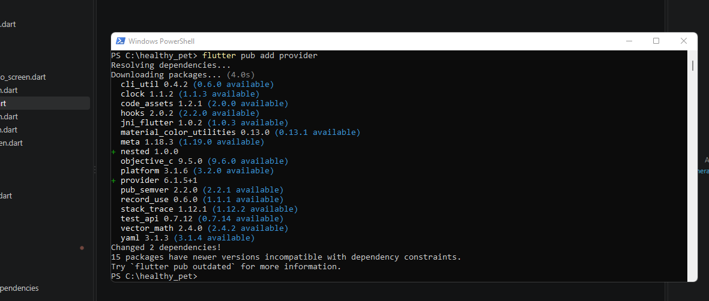

### 2. Favorito utilizando Provider

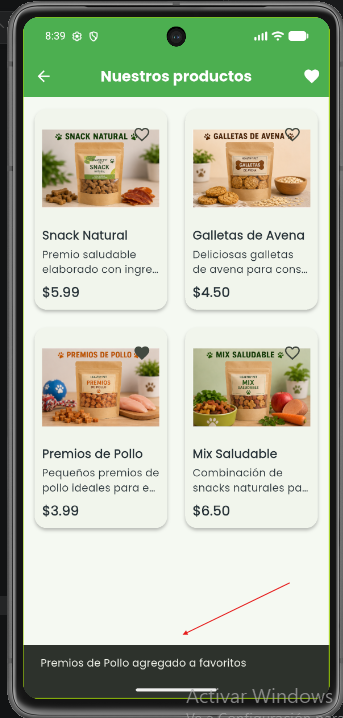

### 3. Favoritos compartidos

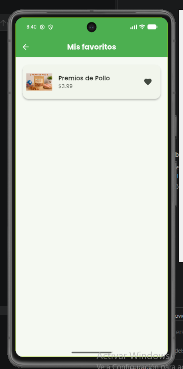

### 4. Modelo y catálogo

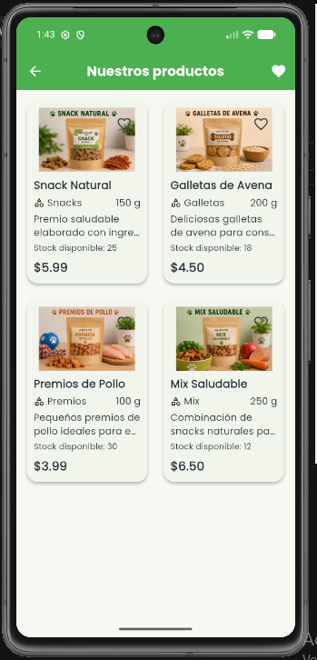

### 5. Widgets reutilizables

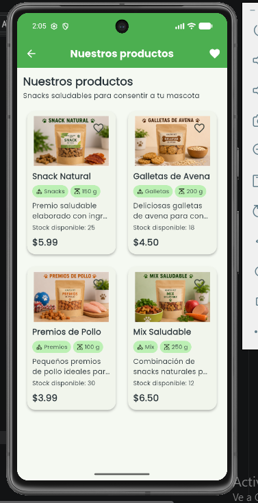

### 6. Carrito vacío

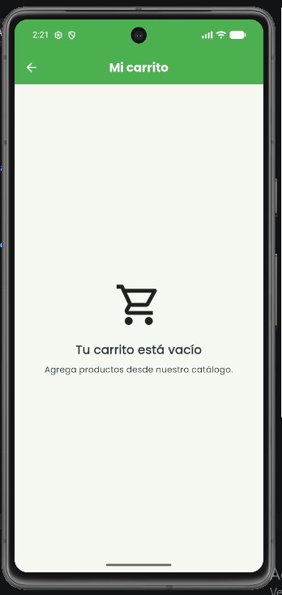

### 7. Agregar producto al carrito

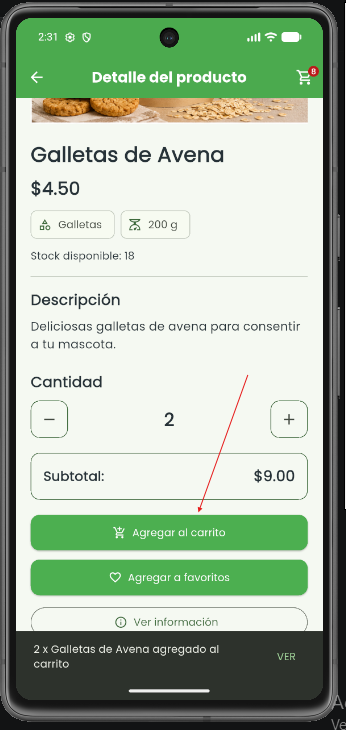

### 8. Carrito con producto

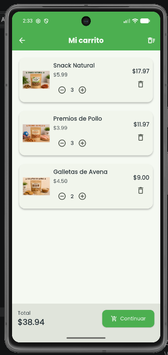

### 9. Resumen del carrito

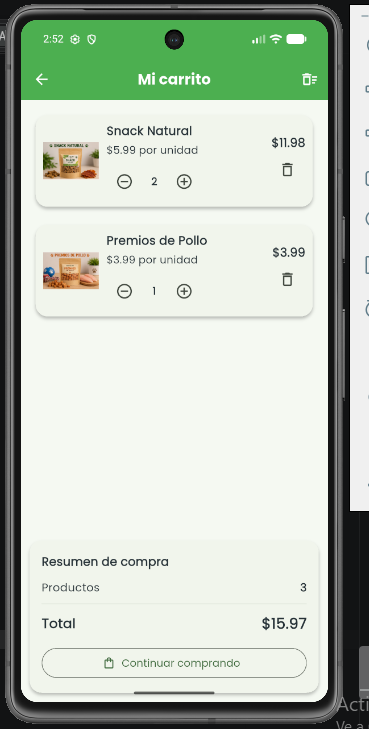

### 10. Actualización de cantidades

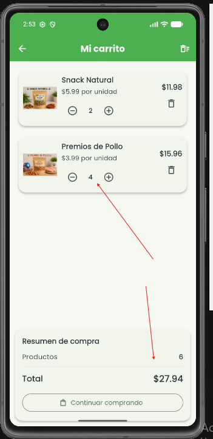

### 11. Navegación final

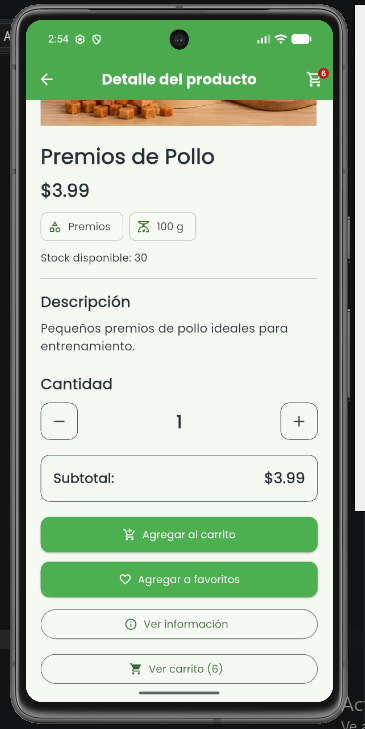

---

## 16. Demostración del estado compartido

Uno de los puntos principales de esta actividad es demostrar que una modificación realizada en una pantalla puede reflejarse en otra pantalla.

Por ejemplo:

```text
Detalle del producto
        |
        | seleccionar cantidad
        |
        v
agregarProducto()
        |
        v
CarritoProvider
        |
        | notifyListeners()
        v
Consumer<CarritoProvider>
        |
        v
Mi carrito
        |
        +-- cantidad actualizada
        +-- subtotal actualizado
        +-- total actualizado
```

De esta manera, el carrito utiliza un estado compartido mediante Provider.

---

## 17. Historial de desarrollo de la Actividad Integradora 3

La tercera fase se desarrolló progresivamente mediante **7 commits significativos**, manteniendo la evolución de la misma aplicación.

### Commit 1
**Implementar estado compartido de favoritos con Provider**

Se instaló y configuró `provider` y se migró la gestión de favoritos a `FavoritosProvider`.

### Commit 2
**Mejorar modelo y catálogo de productos**

Se amplió el modelo `Producto` incorporando categoría, peso y stock, y se actualizó la presentación del catálogo.

### Commit 3
**Crear widgets reutilizables para el catálogo**

Se incorporaron `EtiquetaProducto` y `TituloSeccion`, además de mejorar `ProductoCard`.

### Commit 4
**Implementar carrito de compras con Provider**

Se incorporaron `ItemCarrito`, `CarritoProvider` y `CarritoScreen`.

### Commit 5
**Integrar carrito con productos y detalle**

Se conectó el detalle del producto con `CarritoProvider`, permitiendo seleccionar una cantidad y agregarla al carrito.

### Commit 6
**Mejorar UI, navegación y evidencias**

Se incorporó `ResumenCarrito`, se mejoró la presentación del carrito, la navegación y las evidencias de funcionamiento.

### Commit 7
**Actualizar documentación y finalizar Actividad Integradora 3**

Corresponde al cierre documental de la tercera fase, incluyendo README, evidencias y descripción de las funcionalidades desarrolladas.

---

## 18. Ejecución del proyecto

Para obtener las dependencias:

```bash
flutter pub get
```

Para comprobar los dispositivos disponibles:

```bash
flutter devices
```

Para analizar el proyecto:

```bash
flutter analyze
```

Para ejecutar la aplicación:

```bash
flutter run
```

También puede ejecutarse directamente sobre el emulador Android utilizado durante el desarrollo:

```bash
flutter run -d emulator-5554
```

---

## 19. Resultado de la Actividad Integradora 3

Al finalizar esta tercera fase, Healthy Pet cuenta con una estructura más modular y con gestión de estado compartido.

Las principales mejoras incorporadas son:

- Gestión de favoritos mediante Provider.
- Gestión del carrito mediante Provider.
- Uso de `ChangeNotifier`.
- Uso de `notifyListeners()`.
- Uso de `ChangeNotifierProvider`.
- Uso de `MultiProvider`.
- Uso de `Consumer`.
- Modelo `Producto` ampliado.
- Nuevo modelo `ItemCarrito`.
- Carrito de compras funcional.
- Control de cantidades.
- Cálculo de subtotales.
- Cálculo del total.
- Eliminación de productos.
- Vaciar carrito.
- Resumen visual del carrito.
- Nuevos widgets reutilizables.
- Navegación entre productos, detalle y carrito.
- Integración de estado entre diferentes pantallas.
- Evidencias organizadas en `capturas3`.
- Desarrollo documentado mediante 7 commits significativos.

---

## 20. Continuidad del proyecto

La Actividad Integradora 3 mantiene la evolución progresiva de Healthy Pet:

```text
Actividad Integradora 1
        ↓
Identidad visual y aplicación inicial
        ↓
Actividad Integradora 2
        ↓
Navegación, catálogo, favoritos y detalle
        ↓
Actividad Integradora 3
        ↓
Provider, estado compartido y carrito
```

La aplicación queda preparada para continuar evolucionando en futuras actividades académicas mediante nuevas funcionalidades relacionadas con productos, pedidos, usuarios y procesos de compra.

---

## Healthy Pet 🐾

**Amor en cada bocado**

**Actividad Integradora 3 — Desarrollo de Aplicaciones Móviles**

Autor: **Alberto Steve Espinoza Espinoza**
